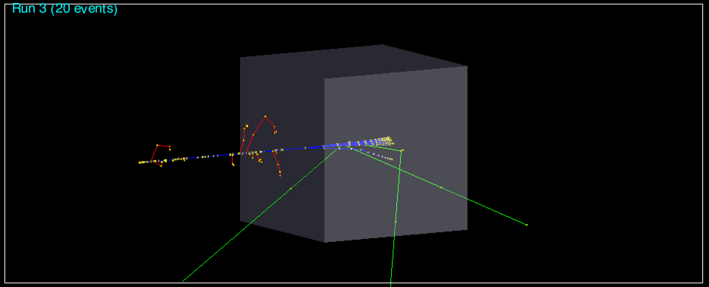

# Geant 4 Start

## Geant 4 컴파일

### CMake

CMake는 컴파일 스크립트입니다. CMake를 사용하기 위해서는 CMakeLists.txt가 필요합니다. CMakeLists.txt는 다음과 같은 내용으로 채워져 있습니다.

```
cmake_minimum_required(VERSION 2.6 FATAL_ERROR)
project(PROJECT_OT)

#----------------------------------------------------------------------------

set(useROOT false)
set(OT_SOURCE_DIRECTORIES src)
set(OT_EXECUTABLES example)
set(OT_SCRIPTS vis.mac)

#----------------------------------------------------------------------------

option(WITH_GEANT4_UIVIS "Build example with Geant4 UI and Vis drivers" ON)
if(WITH_GEANT4_UIVIS)
  find_package(Geant4 REQUIRED ui_all vis_all)
else()
  find_package(Geant4 REQUIRED)
endif()

... 이하 생략
```

여기서 아래부분만 보겠습니다.

```
#----------------------------------------------------------------------------

set(useROOT false)
set(OT_SOURCE_DIRECTORIES src)
set(OT_EXECUTABLES example)
set(OT_SCRIPTS vis.mac)

#----------------------------------------------------------------------------
```

`useROOT false`는 ROOT 패키지를 사용하지 않겠다라는 의미입니다. `OT_SOURCE_DIRECTOREIS src`는 소스파일이 있는 폴더는 src라는 폴더라는 의미입니다. `OT_EXECUTABLES example`는 컴파일할 파일이 example.cc라는 의미입니다. `OT_SCRIPTS vis.mac`는 Geant4를 실행할 때 참고하는 프로그램이고 vis.mac은 매크로 파일 중 하나입니다. 이제 컴파일 준비가 끝났습니다.

```bash
#include "globals.hh"
 
int main()
{
    G4cout << "Hello Geant4" << G4endl;
    return 0;
}
```

다음과 같은 Geant4 커맨트로 "Hello Geant4"를 출력합니다. build폴더에서 컴파일합니다.

```bash
cmake ..
```

위 커맨드는 컴파일에 필요한 파일을 만드는 커맨드입니다. cmake 이후에는 CMakeLists.txt파일이 위치한 폴더를 지정합니다. 이제 build 폴더에 컴파일에 필요한 많은 파일들이 생겼습니다.

```bash
make
./example
```

`make`로 컴파일합니다. "Hello Geant4"가 출력될 것입니다.


###소스파일 

Geant4 시뮬레이션에 필요한 클래스를 만들어 놓은 파일들이 있습니다. **특별한 메서드가 필요하면 해당 클래스에서 생성한 뒤 run_manager에 연결하면 바로 사용할 수 있습니다.** 이는 두가지 클래스로 나뉩니다.

#### User Initialization Class

시뮬레이션을 시작하기 전에 초기화하는 역할을 합니다. 여기서 DetectorConstruction과 같이 물질을 정의하는 작업도 수행합니다.

```
G4VUserDetectorConstruction
G4VUserPhysicsList
G4VUserActionInitialization
```

G4VUserDetectorConstruction로 물질을 생성해 보겠습니다. `src/OTDetectorConstruction.cc`파일에서 정의합니다.

```c++
#include "OTDetectorConstruction.hh"

#include "G4RunManager.hh"
#include "G4NistManager.hh"
#include "G4Box.hh"
#include "G4LogicalVolume.hh"
#include "G4PVPlacement.hh"
#include "G4SystemOfUnits.hh"

OTDetectorConstruction::OTDetectorConstruction()
: G4VUserDetectorConstruction()
{
}

OTDetectorConstruction::~OTDetectorConstruction()
{
}

G4VPhysicalVolume* OTDetectorConstruction::Construct()
{  
  G4NistManager* nist = G4NistManager::Instance();


  // -----------------------------------------------------
  // World

  G4Material* world_mat = nist -> FindOrBuildMaterial("G4_AIR");
  G4double world_size = 100*mm;

  G4Box* solidWorld =    
    new G4Box("World",                       // its name
              0.5*world_size,                // half x
              0.5*world_size,                // half y
              0.5*world_size);               // half z
      
  G4LogicalVolume* logicWorld =                         
    new G4LogicalVolume(solidWorld,          //its solid
                        world_mat,           //its material
                        "World");            //its name
                                   
  G4VPhysicalVolume* physWorld = 
    new G4PVPlacement(0,                     //no rotation
                      G4ThreeVector(),       //at (0,0,0)
                      logicWorld,            //its logical volume
                      "World",               //its name
                      0,                     //its mother  volume
                      false,                 //no boolean operation
                      0,                     //copy number
                      true);                 //overlaps checking


  // -----------------------------------------------------
  // Detector

  G4Material* detector_mat = nist -> FindOrBuildMaterial("G4_WATER");
  G4double detector_size = 20*mm;
  G4double detector_offset_z = 30*mm;

  G4Box* solidDetector =    
    new G4Box("Detector",
              0.5*detector_size,
              0.5*detector_size,
              0.5*detector_size);
      
  G4LogicalVolume* logicDetector =                         
    new G4LogicalVolume(solidDetector,
                        detector_mat,
                        "Detector");
                                   
    new G4PVPlacement(0,
                      G4ThreeVector(0,0,detector_offset_z),
                      logicDetector,
                      "Detector",
                      logicWorld,
                      false,
                      1,
                      true);

  return physWorld;
}


```


#### User Action Class

액션 클래스는 run_manager에 의해 실행됩니다. run_manager는 `G4RunManager`에서 불러올 수 있습니다.

```
G4VUserPrimaryGeneratorAction
G4UserRunAction
G4UserEventAction
G4UserTrackingAction
G4UserSteppingAction
G4UserStackingAction
```

이들 중 G4VUserPrimaryGeneratorAction은 초기 입자 생성을 담당하는 필수 클래스입니다.

`G4ParticleGun`과 `G4ParticleTable` 클래스를 이용해 초기입자 설정을 해보겠습니다. G4ParticleGun은 초기 입자의 시작 위치, 방향, 에너지를 정의하고 G4ParticleTable은 입자들을 정리하는 리스트입니다. `src/OTPrimaryGeneratorAction.cc` 파일에서 정의합니다. 

```c++
// 입자를 발사하는 메서드
void OTPrimaryGeneratorAction::GeneratePrimaries(G4Event* anEvent) {
    fParticleGun -> GeneratePrimaryVertex(anEvent);
}
```

입자를 발사하는 메서드 `GeneratePrimaries(g4Event* event)`는 이벤트가 시작할때마다 불러옵니다. 여러번의 이벤트가 발생할 때마다 위와같은 초기입자를 계속 발생시킵니다. 초기입자의 정의는 다음과 같이 합니다.

```c++
OTPrimaryGeneratorAction::OTPrimaryGeneratorAction()
: G4VUserPrimaryGeneratorAction()
{
  G4int n_particle = 1;
  fParticleGun = new G4ParticleGun(n_particle);

  G4ParticleTable* particleTable = G4ParticleTable::GetParticleTable();
  G4String particleName;
  G4ParticleDefinition* particle
    = particleTable -> FindParticle(particleName = "proton");

  fParticleGun -> SetParticleDefinition(particle);
  fParticleGun -> SetParticleMomentumDirection(G4ThreeVector(0.,0.,1.));
  fParticleGun -> SetParticleEnergy(40.*MeV);
}
```


### 메인 프로그램

#### 헤더파일

메인프로그램에서 먼저 헤더파일을 선언합니다.

```c++
#include "globals.hh"

#include "G4RunManager.hh"
#include "G4VisExecutive.hh"
#include "G4UImanager.hh"
#include "G4UIExecutive.hh"

#include "QGSP_BERT.hh"
#include "OTDetectorConstruction.hh"
#include "OTPrimaryGeneratorAction.hh"
```

`globals.hh`, `G4VisExecutive.hh`, `G4UImanager.hh`, `G4UIExecutive.hh`는 항상 선언합니다. `QGSP_BERT.hh`는 Geant4에서 제공하는 PhysicsList 중에 하나입니다.

#### G4RunManager

run_manager는 메서드를 실행시키는 역할을 하므로 시뮬레이션을 총괄하고 있습니다. **G4RunManager에게 어떤 초기화 클래스, 액션 클래스를 사용할지 알려줘야 합니다.** 

```c++
int main(int argc, char** argv) {
    // G4RunManager 생성자 선언
    G4RunManager* runManager = new G4RunManager;
    // physicsList 선언
    G4ModularPhysicsList* physicsList = new QGSP_BERT;
    
    runManager -> SetUserInitialization(physicsList);
    runManager -> SetUserInitialization(new OTdetectorConstruction());
    runManager -> SetUserAction(new OTPrimaryGeneratorAction());
    runManager -> SetUserAction(new OTEventAction());
    runManager -> SetUserAction(new OTSteppingAction());
    
    ...
}
```

위에서 처럼 `runManager`의 `SetUserInitialization`과 `SetUserAction`으로 사용할 클래스를 설정합니다. 

#### G4VisManager

비쥬얼라이징을 위한 클래스입니다.

#### G4UImanager

시뮬레이션을 하기 위해서는 커맨드로 직접 시뮬레이션을 돌리는 방법과 매크로 파일을 이용해서 돌리는 방법이 있습니다. 

```c++
G4UImanager* UImanager = G4UImanager::GetUIpointer();
// 시뮬레이션 커맨드를 사용했을 때 argument가 있을 경우와 없을 경우
// argument가 있을 경우
if(argc != 1){
	G4String command = "/control/execute";    
    G4String fileName = argv[1];
    UImanager -> ApplyCommand(command+fileName);
//argument가 없을 경우
}else {
    G4UIExecutive* ui = new G4UIExecutive(argc, argv);
    UImanager -> ApplyCommand("/control/execute vis.mac")
    ui -> SessionStart();
    delete ui;
}

delete visManager;
delete runManager;
```

위의 **`if`부분은 argument가 있을 때(특정 macro 파일을 이용해서 시뮬레이션 하는 경우) 실행되는 커맨드입니다.** 즉, 테스트 용이 아닌 `실전용`이죠. **`else`부분은 argument가 없을 때(테스트할 경우) 실행되는 커맨드입니다.** 테스트용으로 프로그램이 잘 돌아가는지 확인하기 위해서 사용합니다. 


### 커맨드 라인

Geant4에서 커맨드 창을 메인 프로그램에서 G4UIExecutive를 통해 켤 수 있습니다.

```c++
G4UIExecutive* ui = new G4UIExecutive(argc, argv);
ui -> SessionStart();
```

커맨드 창에서 많은 작업을 수행할 수 있습니다. `help`에서 커맨드를 확인할 수 있습니다. (혹은 <http://geant4-userdoc.web.cern.ch/geant4-userdoc/UsersGuides/ForApplicationDeveloper/html/AllResources/Control/UIcommands/_.html> 참고)


### 실행

이제 컴파일 이후에 커맨드라인을 켜고 입자를 쏴보겠습니다.

```bash
cd build
cmake ..
make
./example
```

그리고 커맨드 창에서 `/run/beamOn [event number]`를 통해 입자를 발사합니다.

```bash
/run/beamOn 20
```

다음과 같이 그림으로 트래킹을 확인할 수 있습니다.



파란색 선은 + 전하를 가진 입자, 빨간색은 - 전하를 가진 입자, 초록색은 전하가 없는 입잡, 노란색은 스텝점을 의미합니다. **event 한번은 하나의 초기입자 "proton"을 발사합니다. (액션 클래스에서 정의했습니다) 위 그림은 proton 초기 입자를 20번 발사한 track을 겹쳐서 보여주는 그림으로, 한번의 입자는 `World Construction`와 `Detector Construction`과 상호작용 하면서 (이 역시 액션클래스에서 정의) gamma, electron등을 발생시킵니다.**

